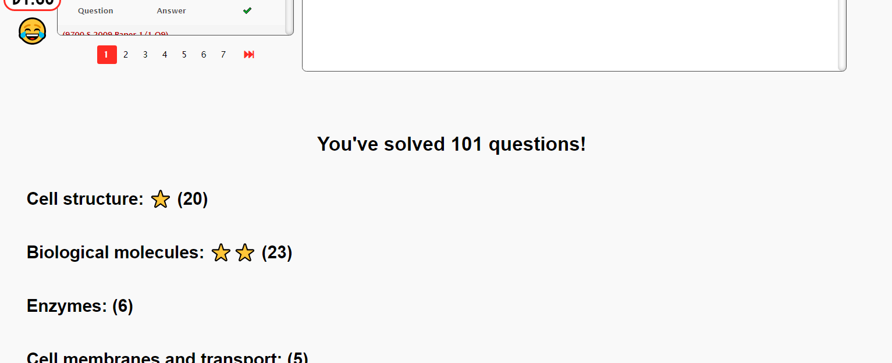

# exammate-plus
This is a Tampermonkey script. Install Tampermonkey to use.
After installing Tampermonkey, press the exammate-plus.user.js file on github and head into raw view. Tampermonkey will automatically detect and ask you to install the script.

You're ready to use it now, visit https://www.exam-mate.com/topicalpastpapers/ to see it in action!

Exam-mate is a highly recommended website whose membership I urge you to buy if you want to practice solving past papers. But they also offer solving for free. Visit their website at https://www.exam-mate.com/ to learn more.

## Features 
- Adds a 📝 button. Solve a question and press it to mark the question as solved.
- Track the number of questions you solved today by a sticker at the top right. Click the sticker to reset the counter.
- A small cute face that changes as you solve more questions to help motivate you.
- Randomly gives motivational messages as you solve questions.
- See your stats on specific topics by looking just under the question panel. Refresh the page to update it.
- Receive a star in the stats for every 10 questions you solve from a specific topic
- A money system that can be customized in code. The app does not give you money, it merely securely determines the amount you should give yourself after solving a specific number of questions. The system is in early development and isn't customizable as of yet because I intended this application for my sisters; however, once more people start using it, I'll certainly make this system more customizable and write a guide on customization.

## Project
First of all, the main feature of this script is to help you with a way to count the number of questions you solved on the website. So every question is fitted with a cool button which when clicked marks the question as solved and increses the counter on the top left.
#### Before
  
#### After  
  
This counter refreshes every single day.
Now obviously, that's not enough motivation. It's just counting. That's why you notice things a bit more than a counter. Let's talk about the face first.  
  
#### The face is more like someone watching your progress and getting amazed more the more questions you do. It starts with a sad face and changes later on.  
  
Another feature is the money under the questions solved counter. This money is a way to reward yourself the more you do questions. The script is trained to detect whether you solved a question or not and rewards you with money that you can give yourself after completing you study session.  
  
#### Now if that's not enough, the script also randomly jumpscares you with motivational messages like this one to boost your motivation:  
  
  
#### Not only that, but the script also adds shows your stats in the current subject just under the question display:
  
The stats include the number of questions you solved in each topic of the subject you're on, so you know which topic to focus more on.  
Sometimes the questions solved in each topic don't add up to the total number of questions and that's because some questions span over multiple topics, in other words, they count as +1 for each topic but only +1 for the total.
Of course, you notice the stars. Every time you solve 10 questions in a specific topic, you get a ⭐.  
  
#### Finally, not all questions are the same, some questions give you double money! These have a special emoji next to them:  

